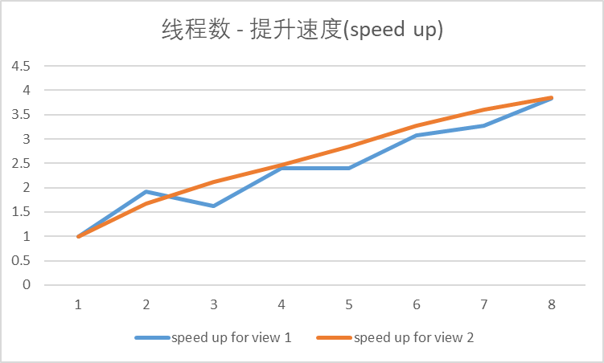
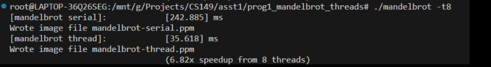
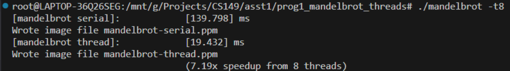
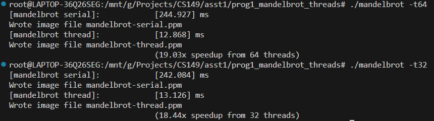

## Program 1: Parallel Fractal Generation Using Threads (20 points)
### question 2

图表：

### question 3

run view 1, thread num 3 \
thread 0 : [0.050065] ms \
thread 1 : [0.152098] ms \
thread 2 : [0.050338] ms \
[mandelbrot thread]: [152.382] ms

run view 2, thread num 3 \
thread 0 : [0.065554] ms \
thread 1 : [0.040952] ms \
thread 2 : [0.037919] ms \
[mandelbrot thread]: [65.636] ms

线程负载不均衡，线程数小于核数时所有线程都是并行的，因此运行时间基本由运行时间最长的线程决定，
由图像可见 view1 的白色区块更多且比 view2 分布更加集中，因此一般情况下view1的运行时间慢且多线程运行时 speed up 更小，
当然，当 thread num = 2 时，明显 view1 的分块更加均衡，此时 view1 的 speed up 高于 view2 

### question4

让每个线程不在运行连续的一块，而是均匀的运行一些行，比如让线程 i 运行 $i + numThread \times k(k \in N )$ 这些行

new speed up for view 1

new speed up for view 2

在较好的情况下，view1 达到了6.82x speed up from 8 threads，view2 达到了7.19x speed up from 8 threads

### question5

在本地 CPU: 13th Gen Intel(R) Core(TM) i9-13980HX 2.20 GHz 下运行，16线程以及32线程依旧有明显提升，查资料可知该 CPU 的线程数为 32，
因此扩大最大线程数上限为 64，并分别用 32 个线程和 64 个线程运行，可以发现 speed up 没有明显提升，分别为 18.44x 和 19.03x，
可以推断当线程数超过 CPU 线程上限时，运行速度并不会有明显提升，因为最多只有最大线程数的程序可以同时运行

