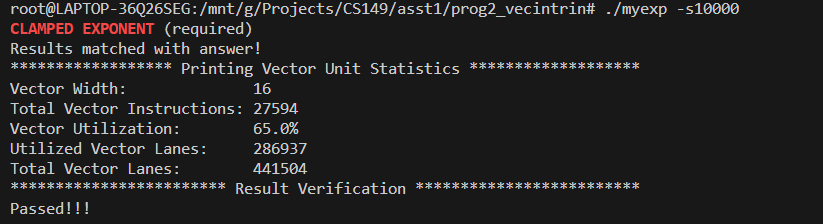

## Program 2: Vectorizing Code Using SIMD Intrinsics (20 points)
### question 2
result images:

当向量的宽度增加，向量的利用率会减少。因为在进行幂运算时，一个向量需要运算的次数是由该向量内幂最大的那个数决定的，当向量的宽度增加，每个向量通道的有效运行次数都是不变的，但是平均的最大运行次数会增加，因此向量利用率会减小

