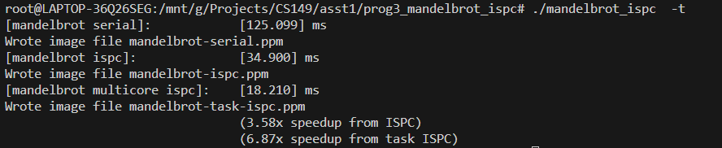
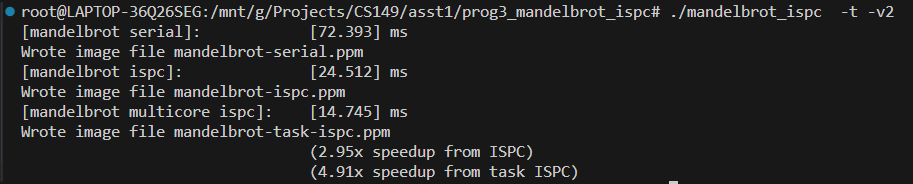

## Program 3: Parallel Fractal Generation Using ISPC (20 points)

### Part 1. A Few ISPC Basics (10 of 20 points)

期望的加速速度应该为 8x \
但是我观察到对于 view1 的加速为 3.53x，对于 view2 的加速为 2.91x \
考虑到 ISPC 的加速形式，它是将多个位置同时进行同一种计算，但是计算会有分支，如同 Program 2 中学到的，一组的计算时间是由最慢的那个决定的，因此会有一定的性能浪费，这是无可避免的，view1 的加速比 view2 大，这是考虑到 view2 的图形中黑白区域的交替频率更高，因此会有更多的浪费。

### Part 2: ISPC Tasks (10 of 20 points)
#### question 1

#### question 2
我认为当数字更改为 8 时能达到最大加速速率，因为该 CPU 有 8 个线程
本地：本地当 32 线程之后还有提升，但是最多是可以达到 40x 的加速

#### question 3
没有什么比较肯定的想法，launch 10000 会段错误，但是 create 10000 个线程不会段错误，ispc launch应该比手动 join 更高效 \
launch 函数在返回前会等待所有由当前函数创造的任务返回后再返回
