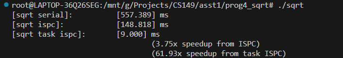
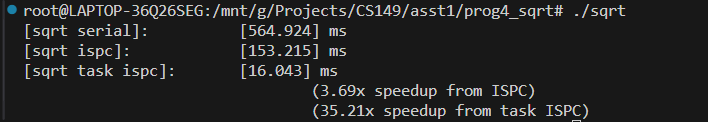
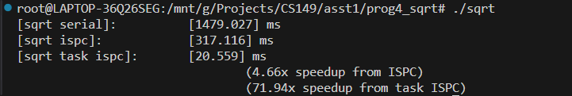
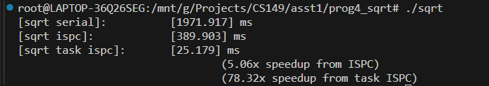
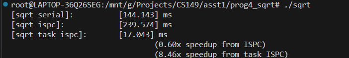
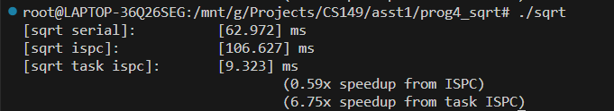
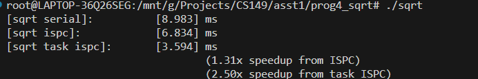

## Program 4: Iterative sqrt (15 points)
### question 1
图中的task数为64，测试task=32时加速比与task=64时相同

图中的task数为16，加速比约为task=32时的两倍，本机CPU为32线程

### qeustion 2
$ values[i] = 2.9999f; $ \

$ values[i] = 2.99999f; $ \

迭代次数相同且迭代次数越多，加速比越大（但是在本机上，2.999 相对于随机的提升并不是十分明显，原因未知）

### qeustion 3
$ values[i] = (i \% 8 == 0) \ ? \ 2.999f : 1.f; $ \
此时 [sqrt ispc] 的 speed up 最小，甚至负优化，但是由于多线程下依旧有提升

$ values[i] = (i \% 8 == 0) ? 0.001f : 1.f; $ \
此时的加速比比上面还小

将 $0.001, 2.999$ 换成其他的离 $1$ 有一定距离的数，对于 [sqrt ispc] 的 speed up 影响不大，稳定在 0.6x 附近，对于 [sqrt task ispc] 的影响参考下面

$ values[i] = 1.f; $ \
此时 [sqrt task ispc] 的 speed up 最小，因为迭代次数都十分的小，并行计算提升小的同时多线程的开销占比变大

### qeustion 4
Extra Credit: (up to 2 points) Write your own version of the sqrt function manually using AVX2 intrinsics. To get credit your implementation should be nearly as fast (or faster) than the binary produced using ISPC. You may find the Intel Intrinsics Guide very helpful.

先跳过，需要单独的学习
