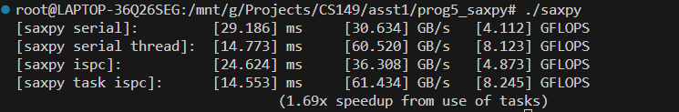

## Program 5: BLAS saxpy (10 points)
### question 1
此处数据量为 60M ，通过多次测试，可知在多线程并行（线程数 >= 4）的情况下，不管是否采用 ISPC，或者再增加线程数，最终运行时间都十分接近，但是此时线程数远远没达到CPU可以并行的最大线程数，因此可以推断影响上限的并不是CPU运行速度，而是内存和高速缓存的读取速度，所以不可能通过重写代码以到达线性的加速比

### question 2
CPU 需要将数据写入 result 中，会先把数据从内存中读入到高速缓存中，在写入一定时间后，随着高速缓存的更新，该数据需要从高速缓存中移回内存当中，因此需要再进行一次内存操作，共占两次操作

### question 3
无能为力

