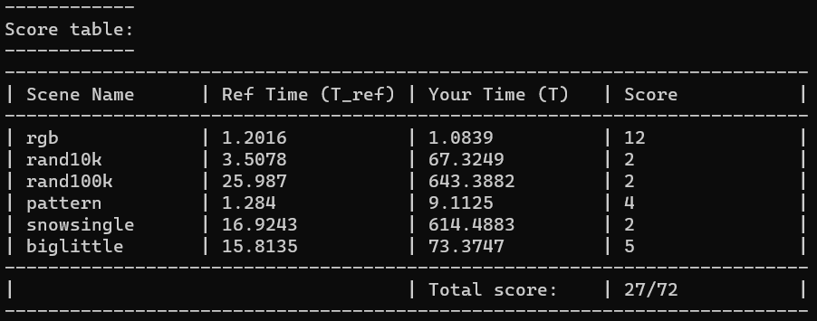

## Part 1: CUDA Warm-Up 1: SAXPY (5 pts)

### Question 1 & 2

如果仅仅考虑计算部分，GPU 的速度远超串行 CPU 实现（比较 GB/s 部分，双方数据量不同，GPU 为 100M，CPU 为 20M），但是受到 GPU 带宽影响，如果算上数据传输的时间，速度就小于 CPU 了，测试的带宽速度与实际的基本一致

## Part 2: CUDA Warm-Up 2: Parallel Prefix-Sum (10 pts)

### 遇到的问题：
问题：发现 THREADS_PER_BLOCK $\times$ Number of elements $\le 2^{31}$ 才行，不然会出问题

原因：每次需要计算的数量很少时，拿 1 作为例子，当只有一个数需要计算，如果我每个块还是开了 THREADS_PER_BLOCK=256 个线程，那么在计算 index *= two_dplus1 时，会产生越界，导致结果出错

解决：在循环处分两种情况处理，比如写两个 while 循环，还可以简单的将 index 的变量类型改成 long long

### 运行结果： 

## Part 3: A Simple Circle Renderer (85 pts)

每一版本的实现都在对应文件夹中 ./asst3/answer/(1, 2, 3)/...

### 第一版实现
将所有像素点并行，每个像素点都遍历所有的圆
运行结果：

[4096, 256] 变成 [, 1] 后的结果（之后再说吧，第一版罢了

### 第二版实现
将像素点分成一定的块，每个块遍历所有的圆
运行结果：

反而变得更慢了

考虑到每个 block 之内的线程都是执行同一指令的，想着调小 threads_per_block 后结果会如何
对于第二版，提升十分明显
由 [4, 256] 变成 [256, 4] 之后的结果

这个数据基本是当前方法的最优解了

### 第三版实现
依旧将像素点进行一定的分块，之后并行求出每个块被覆盖的圆的数量，然后为每个块分配对应的空间，用于保存与其相关的圆，然后在并行圆将对应的数据填入对应的空间。
然后并行所有的块，将对应的圆的编号进行排序。
最后并行像素点，每个像素点找到对应的块所对应的圆的编号。

每个块 16 * 16 的像素，分成 64 * 64 个块，此时该实现速度最快

#### 尝试优化：以下皆基于 rand100k 进行思考

经过检测，时间组成的三个部分，申请空间，排序，像素并行的计算

申请空间：申请空间的时间主要跟分成的像素块数量成正相关，即分的块越多，花的时间越多

16 * 16 需要约 1ms，32 * 32 需要约 3ms，64 * 64 需要约 10ms，10ms 已经有点难以接受了，考虑选择 16 或者 32

排序：排序的主要与数据量和 GPU thread_per_block 有关

16 * 16: <<<16, 16>>> 5.5ms, <<<4, 64>>> 4.2ms, <<<1, 256>>> 3.3ms

32 * 32: <<<4, 256>>> 3.5ms, <<<1, 1024>>> 5ms, <<<16, 64>>> 5ms, 基本可以决定选择 256, 不足 256 时直接取数量（64 * 64 时 4,1024 较优，差距不大）

像素并行计算：

跟分块数量和 GPU thread_per_block有关，因为分块数量影响了每个像素最后需要计算的圆的数量，分块越多，影响越小

8 * 8: 46.5ms, 16 * 16: 31.7ms, 32 * 32: 26.3ms, 64 * 64: 18.7ms, 这里可以完全排除 8 * 8 (这里为 <<<1024, 1024>>>,可能不是最优的)

以上数据的前提为未经过 circleInBox 函数的优化，根据上述信息可以得到最优的选择为 32 * 32，不排除其他优化后 16 或者 64 反超

经过 circleInBox 减少了一定的冗余的数据之后，并且通过不断的修改 GPU thread_per_block，基本可以得到每个情况的最优解(64 * 64 由于内存分配的时间完全败下阵来)：

32 * 32：

16 * 16：

### 第四版实现

接下来的优化空间应该只有排序算法的选择和快速的内存分配了

排序：目前用了堆排序的方法，因为不用再开什么内存了并且好写（循环形式），时间复杂度稳定O(nlogn)，但是按理来说常数较大，可以考虑用快排试试

内存分配：由于在 GPU 中并行分配内存遇到了 999 的错误，因此采用外部串行分配的形式，大部分时间开销是多余，如果能快速分配的话肯定能块很多

内存分配的一种优化思路，一次性分配大块内存，由于已经求出了每块内存所需的大小，因此可以用 part2 的前缀和算法来得到每块内存的起始位置和总内存大小，在内存分配速度达到极限之后 32 * 32 应该是完全优于 16 * 16的（目前在 rand10k 和 rand100k 时各有优劣）（额，突然感觉在胡言乱语）

内存分配优化完成后的各项数据，此时内存分配所占的时间都在 1ms 以内且受分块数量的影响十分小（感觉只要别把显存爆了就行），此时如果增加块的数量，会使排序时间增加，像素并行计算的时间减少，且当块数到达 64 * 64 之后排序时间占比大幅增加

64 * 64

内存分配优化的结果令我大跌眼镜，我仅仅是把之前分好几次分配的内存一次性申请了，却导致评分急剧下滑，但是我自己添加计时得到的分析证明速度变快了，但是在运行 check 却发现十分的慢

改了一点点不知道什么东西，好了

16 * 16：

32 * 32：

64 * 64：

关于 biglittle，想不到怎么优化了，许多小圆在一个地方重叠，最后一步像素并行运算的时间很大，当前实现暂时想不到优化空间了

