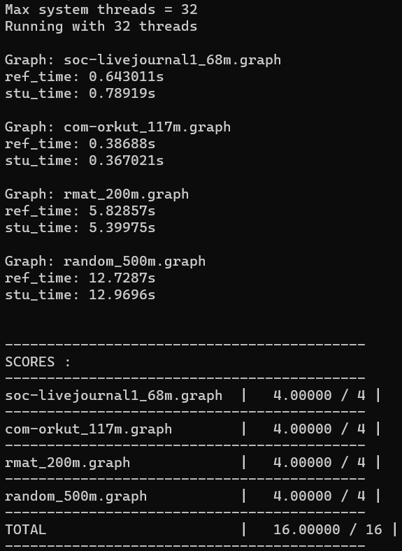
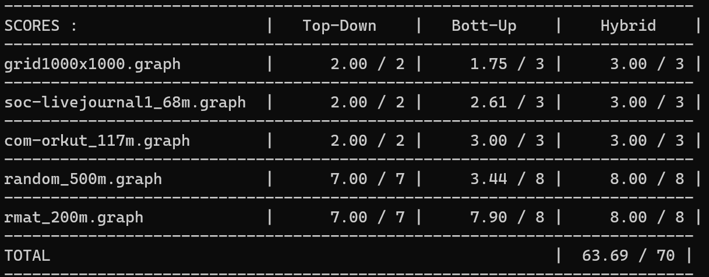

## Part 1: Warm up: Implementing Page Rank (16 points)

用 OpenMP 的时候，能用 reduction 就用 reduction，比 atomic 和 critical 快很多。atomic 用的时候也要注意不要把一些不互斥的变量放进去。

将一个数组指针传入函数之后，不要释放不是函数内开辟的空间。注意在函数内改变该指针指向的地址，并不会影响函数外该指针指向的地址。

## Part 2: Parallel Breadth-First Search ("Top Down")

自上而下部分的代码参考了 https://github.com/PKUFlyingPig/asst4/blob/master/bfs/bfs.cpp

之前所有的 parallel 和 for 都是放在一起用的，这种在 parallel 和 for 之间加入一些单个线程私有的变量，用这些私有的变量有时候可以给程序带来更好的性能。比如对于 Top Down bfs，程序的性能瓶颈之处是多个线程对单独一个全局 count 的竞争，因此可以将总的 count 变成每个线程都拥有一个单独的 count，在每个线程要结束时再将私有的 count 合并到总的 count，这样子可以大幅减少对于 count 的竞争，因为单个线程内是不会产生竞争的，唯一的竞争只有最后合并的时候。

part1 用上这个方法的话可能还能继续优化

## Part 3: "Bottom Up" BFS

std 应该跟目前的不是一种思路，当前方法较方便与 part2 切换

玄学: #pragma omp for schedule(dynamic, 200) 、 #pragma omp for schedule(dynamic) 和 #pragma omp for 之间的差距真离谱，个人任务在对于有 continues 时以及内部循环有 break 时最好使用 schedule(dynamic, xxx)，但是别用 schedule(dynamic)，在我使用的几种情况下性能都是一坨

## Part 4: Hybrid BFS (70 points)

随便写了个边界，Hybrid BFS 就没问题了，但是 "Bottom Up" BFS 问题挺大

